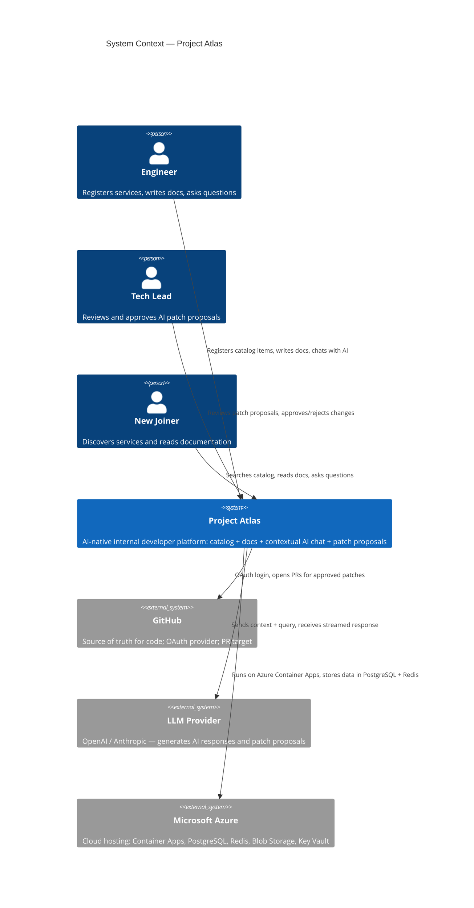
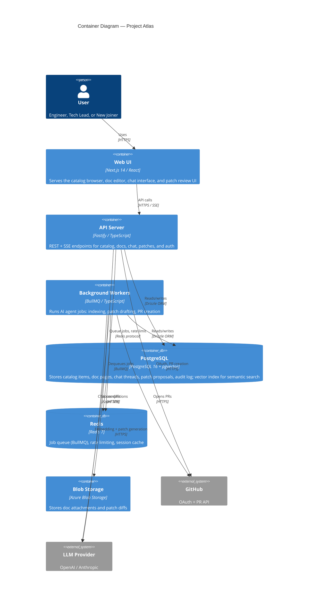
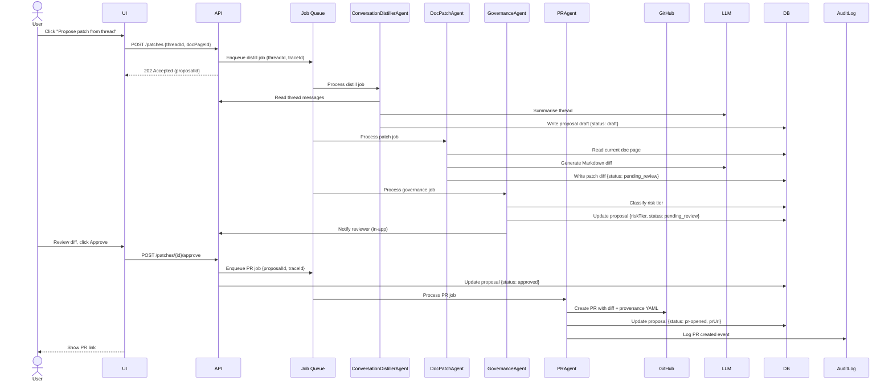
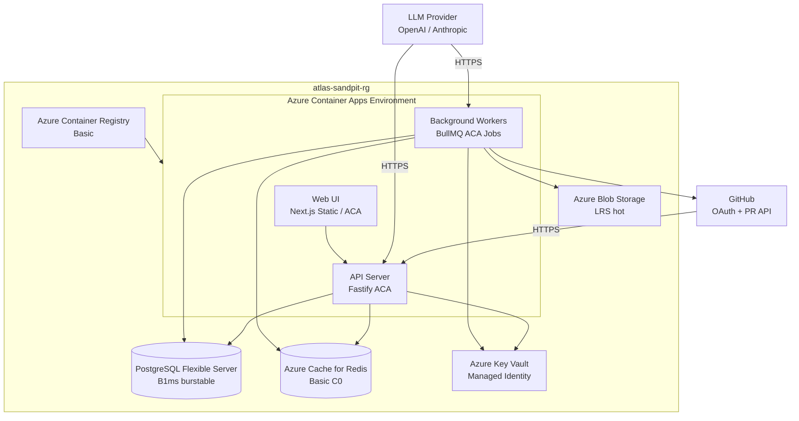

# Architecture — C4 Model

This document describes the Atlas system architecture using the [C4 model](https://c4model.com/): Context, Containers, Components, and Code. Diagrams are written in [Mermaid](https://mermaid.js.org/) for inline rendering on GitHub.

---

## Level 1 — System Context

> Who uses Atlas and what external systems does it interact with?



---

## Level 2 — Container Diagram

> What deployable units make up Atlas?



---

## Level 3 — Component Diagram (API Server)

> What are the major components inside the API server?

```mermaid
C4Component
  title Component Diagram — API Server

  Container_Boundary(api, "API Server") {
    Component(authRouter, "Auth Router", "Fastify plugin", "GitHub OAuth flow via Better Auth; issues session tokens")
    Component(catalogRouter, "Catalog Router", "Fastify plugin", "CRUD for catalog items; search via Postgres FTS")
    Component(docsRouter, "Docs Router", "Fastify plugin", "CRUD for doc pages; version history; provenance display")
    Component(chatRouter, "Chat Router", "Fastify plugin + SSE", "Creates threads, streams AI responses, persists messages")
    Component(patchRouter, "Patch Router", "Fastify plugin", "Patch proposal lifecycle: create, review, approve, reject")
    Component(contextAgent, "ContextAgent", "TypeScript service", "Retrieves semantic context chunks for a query from pgvector")
    Component(llmClient, "LLMClient", "TypeScript service", "Abstracts OpenAI / Anthropic; handles streaming, retries, token logging")
    Component(jobQueue, "Job Queue Client", "BullMQ", "Enqueues background agent jobs with traceId propagation")
    Component(auditLog, "Audit Logger", "TypeScript service", "Writes structured audit events for all patch lifecycle actions")
  }

  Rel(authRouter, db, "Read/write users and sessions")
  Rel(catalogRouter, db, "CRUD catalog items")
  Rel(docsRouter, db, "CRUD doc pages + versions")
  Rel(chatRouter, contextAgent, "Fetch context chunks")
  Rel(chatRouter, llmClient, "Stream chat response")
  Rel(chatRouter, db, "Persist messages")
  Rel(patchRouter, jobQueue, "Enqueue patch/PR jobs")
  Rel(patchRouter, db, "Read/write patch proposals")
  Rel(patchRouter, auditLog, "Log lifecycle events")
  Rel(contextAgent, db, "pgvector similarity search")
```

---

## Level 3 — Component Diagram (Background Workers)

> What agents run as background workers?

```mermaid
C4Component
  title Component Diagram — Background Workers

  Container_Boundary(workers, "Background Workers") {
    Component(indexAgent, "IndexingAgent", "BullMQ worker", "Chunks doc pages, generates embeddings, upserts to pgvector")
    Component(distillerAgent, "ConversationDistillerAgent", "BullMQ worker", "Summarises chat thread into a structured patch proposal draft")
    Component(patchAgent, "DocPatchAgent", "BullMQ worker", "Generates Markdown diff against the current doc page")
    Component(govAgent, "GovernanceAgent", "BullMQ worker", "Classifies patch risk tier; routes for appropriate approval flow")
    Component(prAgent, "PRAgent", "BullMQ worker", "Creates GitHub PR with diff and provenance YAML front-matter")
  }

  Rel(indexAgent, db, "Upsert embeddings", "pgvector")
  Rel(indexAgent, llm, "Generate embeddings", "HTTPS")
  Rel(distillerAgent, db, "Read thread messages, write proposal draft")
  Rel(distillerAgent, llm, "Summarise thread", "HTTPS")
  Rel(patchAgent, db, "Read doc page, write patch diff")
  Rel(patchAgent, llm, "Generate Markdown patch", "HTTPS")
  Rel(govAgent, db, "Read proposal, write risk classification")
  Rel(prAgent, github, "Create PR", "GitHub API")
  Rel(prAgent, db, "Update proposal status to approved/PR-opened")
  Rel(prAgent, auditLog, "Log PR creation event")
```

---

## Data flow — AI patch proposal (happy path)



---

## Deployment architecture (Azure sandpit)


